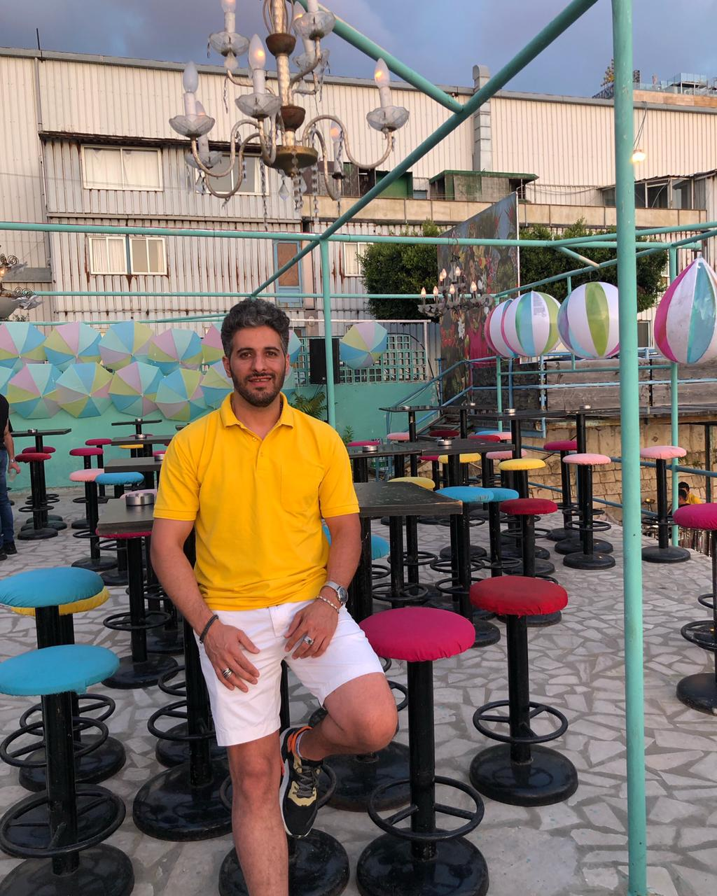

# Achraf Rachini     

**Born on 8/1/1989 Beirut, Lebanon** 

`                              `**[ achraf.alrachini@gmail.com** ](mailto:achraf.alrachini@gmail.com)**

**00961-3-949509** 

***Fully vaccinated*** 

**OBJECTIVE** Seeking  a  good  opportunity  in  a  healthy  environment  where  I  can  utilize  my 

background for mutual professional growth and advancement 

**EDUCATION 2007-2012 M.S. in Informatics and Telecommunication**  

`                            `Antonine University, Zahle–Lebanon 

`                            `Focus of thesis: Vb.net and SQL server 

**2005-2006 General Maths Baccalaureate** 

`                            `Hermel high school, Bekaa– Lebanon 

`                            `Holder of honor degree from the ministry of education 

**JOB EXPERIENCE  2017- now Floor manager at Zuruna Resto-Cafe** 

- Maintaining good atmosphere, customer service, solving problems,  hiring, ensuring healthy & quality serving …  

**2019- 2020 Teacher and informatics officer at *B*araem school**

- computer courses for intermediate level 
- School data entry duties 

**2018-2019 ECE educator at Hermel third school**

- Maths courses for intermediate level 
- Basic literacy and numeracy courses 

**2017-2018 BLN educator and informatics officer at Hermel second school** 

- Maths courses for elementary level  
- School data entry duties 
- Basic literacy and numeracy courses 

**2014-2017 General office supervisor at Dana services** 

- **Coach, monitor, organize** 

**2012-2014 IT Assistant and data entering at Yellow Pages** 

- Advertising website by entering Data according to the connection between the website and SQL server. 

**2010-2011            Training at MGG company** 

**Arabic:** mother language **LANGUAGES**

**French:** advanced level **English:** Basic level 

**PERSONAL  Holder an achievement certificate of Microsoft SQL Server **

**SKILLS Holder a membership card of engineers Syndicate** 

**COMPUTER  Adobe Flash (AS2-AS3), Photoshop, Illustrator. **

**SKILLS HTML, XML, UML, Oracle, Unix, Linux, Java, C/C++, Microsoft Office** 

**INTERESTS  Reading, writing, conducting research, swimming, hiking, surfing the Net REFERENCES  Mrs. Hanane Nasserdine : Principal at Hermel third school : 71844627** 

**Mr. Ali Al Massri : Principal at Hermel second school : 03987387** 

**Mr. Nawfal Gherbawi : IT manager at Hermel second school : 03847336** 